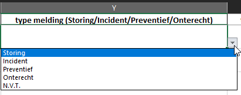

# Handleiding Storingsanalyse Generator
Dit Document dient als de handleiding ter ondersteuning van het genereren van de storingsanalyse en om de gebruiker 
de weg te wijzen langs de verschillende notebooks die zijn opgebouwd.

## Inhoud
De inhoud van deze handleiding bestaat uit de volgende punten.

1. [Processen](#processen)

2. [Genereren van een nieuwe storingsanalyse](#genereren-van-een-storingsanalyse)
    1. [Het genereren van een staging file.](#genereren-van-een-staging-file)
    2. [Specificeren van het melding type.](#specificeren-van-het-type-van-de-melding)
    3. [Genereren van de tekst en bijlage.](#genereren-van-de-storingsanalyse-bestanden)
2. [Toevoegen van een nieuw project](#toevoegen-van-een-nieuw-project)
3. [Verdere ondersteuning](#verdere-ondersteuning)

## Processen
In de map `processen` staan een aantal processen. Deze processen worden in onderstaande tabel opgesomd met een korte
beschrijving van de taak/taken waar deze processen verantwoordlijk voor zijn.

|process|omschrijving|
|-------|------------|
|building_metadata_file| Opbouwen van de het metadata bestand. Het bestand met algemene informatie over het project en de historische data.|
|staging_file_builder| Bevragen van de Maximo database en het opbouwen van de staging file.|
|generating_storingsanalyse_documents| Genereren van de tekst en de bijlage voor het rapport van de storingsanalyse.|

## Genereren van een storingsanalyse
Het algehele proces van het genereren van een storingsanalyse rapport bestaat in grote lijnen uit drie aansluitende 
processen:

1. Het genereren van een staging file.
2. Het specificeren van het type van de verschillende meldingen in de staging file.
3. Het genereren van het tekst bestand en de bijbehorende bijlage.

### Genereren van een staging file
Het eerste proces dat men moet doorlopen, is het genereren van een staging file. Een staging file is een xlsx-bestand 
gevuld met regels die allemaal een melding representeren. Waarom dit bestand gegenereerd moet worden, is om de 
input van de maintenance engineers te krijgen en de verschillende meldingen te classificeren op basis van het type van
de melding.

Voor het genereren van een staging file is de notebook `staging_file_builder.ipynb` beschikbaar gemaakt in de map 
`processes/staging_file_builder`. De notebook is aangevuld met de specifieke stappen die doorlopen moeten worden 
voor het starten van, en na het uitvoeren van de notebook.

Wanneer de staging file gegenereerd is, moet het bestand handmatig gedownload worden uit de map `data/staging_file`.
Dit kan gedaan worden door het bestand te selecteren door het witte vierkantje voor de bestandsnaam te selecteren, om
vervolgens **Download** te selecteren (zie onderstaande afbeeldingen).


### Specificeren van het type van de melding
Wanneer het bestand is gedownload, moet er per melding het type van dee melding gespecificeerd worden. Dit is te 
realiseren door middel van de dropdown lijst die is toegevoegd aan de cellen in kolom Y (zie onderstaande afbeelding).



Als bij elke melding een type is toegevoegd, kan het bestand weer geupload worden in de serveromgeving. Het is hierbij 
van groot belang dat het oude bestand wordt verwijderd uit de map voordat de volgende stap wordt uitgevoerd.

Uploaden is mogelijk volgens de optie **Upload** rechtsboven op het scherm (zie onderstaande afbeelding).


### Genereren van de storingsanalyse bestanden
Voor het genereren van een staging file is de notebook `storingsanalyse_generator.ipynb` beschikbaar gemaakt in de map 
`processes/3. generating_storingsanalyse_documents`. De notebook is aangevuld met de specifieke stappen die doorlopen 
moeten worden voor het starten van, en na het uitvoeren van de notebook.

Na het doorlopen van het script, zijn de documenten beschikbaar in de map `documents/generated_documents`. Deze kunnen
worden gedownload zoals [hier](#Genereren-van-een-staging-file) omschreven.

## Toevoegen van een nieuw project
Het toevoegen van een nieuw project bestaat uit meerdere handelingen die eenmalig uitgevoerd moeten worden. Deze 
handelingen zijn:
   - Het beschikbaar maken van de location_description_map van het specifieke project.
   - Het genereren van een metadata bestand.

### De location_description_map
De location_description_map (verder: ld_map) is niet meer dan een bestand waarin de betekenis van de sbs en lbs nummers
worden gekoppeld aan de beschrijving die op dat project gehanteerd worden. Dit overzicht is gemakkelijk te verkrijgen
wanneer de koppelingen al in Maximo zijn gerealiseerd. Raadpleeg de Maximo consultant voor het verkrijgen van deze
data. Daarbij is het belangrijk dat de ld_map wordt opgeslagen in de map 
`resource/information_mapping/location_description_mapping` én dat de juist naamconventie wordt toegepast. Deze 
naamconventie is als volgt opgebouwd: `location_description_map` gevolgd door `_` en de naam van het project, volledig
lower case. Sla het bestand ook altijd op als `.json`.
Voor het project `Coentunnel-tracé` wordt de naam dan als in het onderstaande voorbeeld:
```
location_description_map_coentunnel-tracé.json
```

### Genereren van het metadata bestand
Daarbij komt dat er binnen het toevoegen van een nieuw project onderscheid wordt gemaakt tussen twee lijnen:
   1. Het toevoegen van een project dat al in beheer is.
   2. Het toevoegen van een project dat nieuw in beheer komt.

Dit onderscheid in lijnen uit zich enkel in het gebruik van een andere notebook voor het genereren van het metadata
bestand.

#### Het verschill tussen de twee lijnen
Het grote verschil tussen de twee lijnen is de beschikbaarheid van historische data in het format dat door de
maintenance engineers is geïntroduceerd. Dit format is een excel document dat, voor deze automatisering, werd gebruikt 
voor het maken van een storingsanalyse. Een voorbeeld van dit document is te vinden in de map 
`documents/exaple_documents` als `brondocument_metadata.xlsx`.

#### De werkwijze
Beide notebooks voor het genereren van het metadata bestand zijn te vinden in de map 
`processes/1. building_metadata_file`. Zo is de notebook `metadata_file_builder_new_project` voor het genereren van
een metadata bestand voor een project dat nieuw in het beheer komt, en waar dus de historische data ontbreekt. De 
notebook `metadata_file_builder.ipynb` wordt gebruikt voor het toevoegen van een project dat al in het beheer is van
CWD-Infra en waar dus wel historische data van bekend is.

Voor beide documenten geldt dat in de notebook stappen zijn uitgeschreven die uitgevoerd moeten worden om het proces
uit te voeren en af te ronden, net als bij de eerder besproken notebooks voor de andere processen.

## Verdere ondersteuning
Voor meer informatie over de backend van de automatisering en de methods die daar beschikbaar zijn, bekijk dan de
documentatie van de backend (`backend_documentation.md`).
